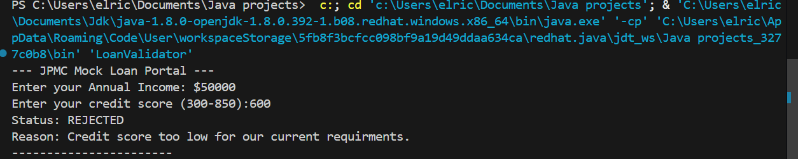

# Java Foundations - Portfolio
This repository contains a collection of foundational Java programs developed to demonstrate core proficiency in object-oriented logic, user input handling, and data type management.

## 🚀 Projects Included
* **HelloDimitri.java**: A fundamental entry point demonstrating basic console output.
* **PowerLevel.java**: An exploration of arithmetic operations and variable declaration.
* **InteractivePower.java**: A dynamic console application using the `Scanner` class to process user input and perform real-time calculations.
* LoanValidator.java: Implementing conditional if-else logic for credit approval.

  MultiLoanProcessor.java: Using while loops to handle multiple calculations in a single session.
* LoanRiskAssessor.java: Demonstrating Explicit Type Casting (double) to ensure high-precision risk probability scores.

BankStatementGenerator.java: My "Capstone" project using Fixed-size Arrays and For-Loops to generate a final batch report for multiple customers.

## 🛠️ Technical Stack
* **Language**: Java 17+
* **JDK**: Red Hat OpenJDK
* **Environment**: Visual Studio Code
* **Version Control**: Git / GitHub

## 🏃 How to Run
1. Clone the repository.
2. Open the folder in VS Code.
3. Ensure the Red Hat Java Extension is installed.
4. Run any `.java` file using the "Run" button or F5.

## 📸 Project Previews

### Loan Validator - Approval Case

### Loan Validator - Rejection Case

* **MultiLoanProcessor.java**: An advanced version of the loan portal utilizing a `while` loop to process multiple customer applications in a single session.

* **MultiLoanProcessor.java**: An advanced version of the loan portal utilizing a `while` loop to process multiple customer applications in a single session.

### Batch Processing Demo

